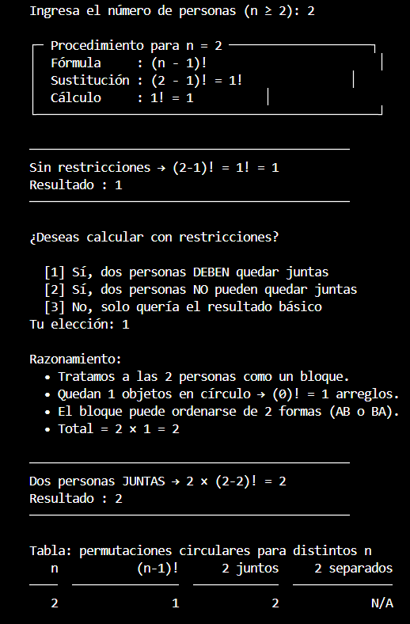
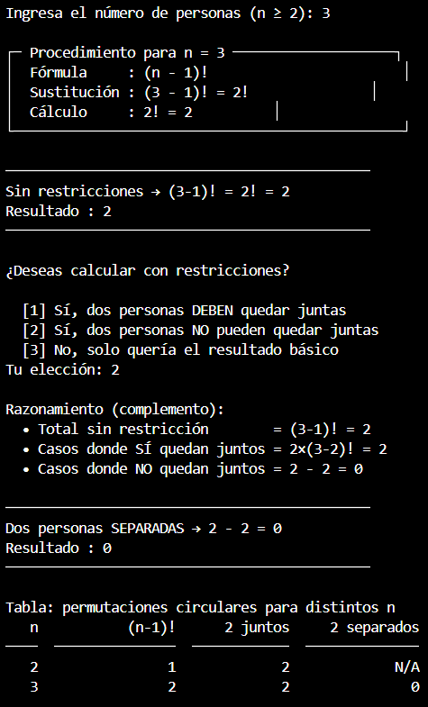
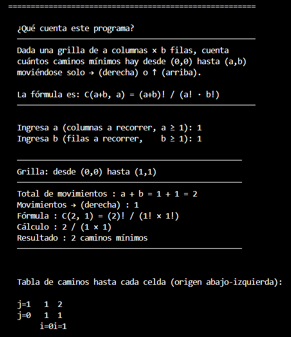
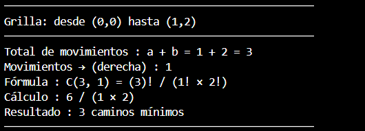

# Bono de Programación — Matemáticas Discretas I
### Universidad Nacional de Colombia

**Asignatura:** Matemáticas Discretas I  
**Docente:** Jhoan Sebastian Tenjo García  
**Corte:** Segundo  
**Problemas resueltos:** 6 y 8

---

## 📁 Estructura del repositorio

```
bono_discretas/
├── problema6_perm_circular.py
├── problema8_caminos_grilla.py
├── img/
│   ├── 6-1.png
│   ├── 6-2.png
│   ├── 8-1.png
│   └── 8-2.png
└── README.md
```

---

## ⚙️ Instalación y ejecución

- Python 3.8 o superior
- Sin dependencias externas (no requiere `pip install`)

```bash
# Problema 6 — Permutaciones circulares
python problema6_perm_circular.py

# Problema 8 — Caminos mínimos en grilla
python problema8_caminos_grilla.py
```

---

## 🔄 Problema 6: Permutaciones Circulares

Cuenta las formas de sentar `n` personas alrededor de una mesa circular, donde dos arreglos son iguales si uno es rotación del otro.

**Fórmula:** `(n - 1)!`

### Prueba 1 — Ejecución normal con restricciones


### Prueba 2 — Validación de entrada inválida


---

## 🗺️ Problema 8: Caminos Mínimos en una Grilla

Cuenta los caminos desde `(0,0)` hasta `(a,b)` moviéndose solo → (derecha) o ↑ (arriba).

**Fórmula:** `C(a+b, a) = (a+b)! / (a! × b!)`

### Prueba 1 — Ejecución con tabla de caminos


### Prueba 2 — Punto obligatorio y punto bloqueado


---

## 📊 Eficiencia

| Problema | Algoritmo | Complejidad |
|---|---|---|
| Factorial | Iterativo | O(n) tiempo, O(1) espacio |
| Perm. circular | Un factorial | O(n) |
| Caminos C(a+b,a) | Producto de min(a,b) factores | O(min(a,b)) |
| Caminos con bloqueo | Tabla DP | O(a×b) tiempo y espacio |
